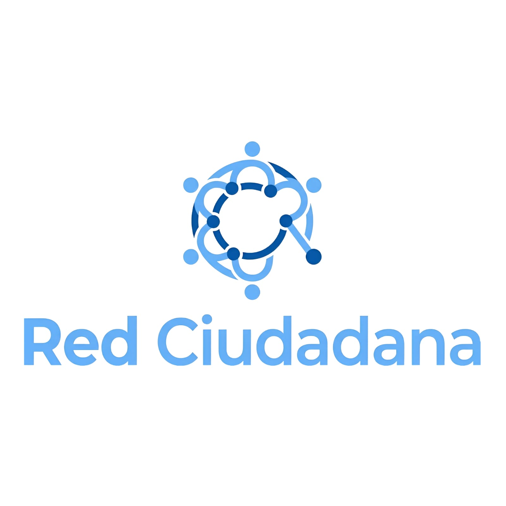

# Red Ciudadana — Sistema de Gestión de Reportes

<h1 align="center">
  <br>
  
  <br>
  Plataforma Red Ciudadana
  <br>
</h1>

<p align="center">
  Aplicación web institucional diseñada para la centralización, clasificación y seguimiento auditado de incidencias y reportes comunitarios en tiempo real.
</p>

<p align="center">
  <a href="[https://github.com/abrahampa21/redCiudadana](https://github.com/abrahampa21/redCiudadana)" target="_blank">
    
  </a>
  
  
</p>

---

## Descripción del Proyecto

Red Ciudadana es una solución tecnológica orientada a la gestión pública y participación civil que optimiza los canales de comunicación entre los habitantes de una comunidad y las entidades encargadas de su administración. El sistema unifica el ciclo de vida completo de un reporte (captura, catalogación, asignación de prioridades y resolución), proveyendo flujos de trabajo transparentes que facilitan la toma de decisiones basada en datos geográficos u operativos.

## Módulos y Funcionalidades Clave

* **Portal de Reportes Ciudadanos:** Interfaz optimizada para que los usuarios registren incidencias de manera ágil, adjuntando descripciones y metadatos específicos del problema.
* **Panel de Control Administrativo:** Consola dedicada para que los administradores y autoridades evalúen las incidencias entrantes, clasifiquen su impacto y asignen estados de progreso.
* **Trazabilidad y Estado de Resolución:** Motor de seguimiento dinámico que registra la evolución de cada caso en tiempo real (Pendiente, En Proceso, Resuelto), garantizando la rendición de cuentas.
* **Indicadores e Historial Comunitario:** Almacenamiento histórico de datos para identificar patrones de fallas, zonas de alta reincidencia y tiempos promedio de respuesta institucional.

## Arquitectura Técnica

El desarrollo implementa patrones de diseño modulares que aseguran un procesamiento desacoplado y una experiencia fluida del lado del cliente:

* **Capa de Presentación:** Interfaz intuitiva y adaptativa (Responsive UI) construida con estándares web nativos para garantizar accesibilidad desde estaciones de escritorio o dispositivos móviles en campo.
* **Lógica de Estado y Control:** Arquitectura modular en scripts encargada de procesar los formularios, validar los campos requeridos en tiempo real y manejar las peticiones del sistema.
* **Persistencia e Integración de Datos:** Modelos de datos estructurados para interactuar con bases de datos relacionales, asegurando la integridad referencial de los reportes y la seguridad de los registros civiles.

---

## Instalación y Despliegue Local

### Prerrequisitos
Antes de inicializar el entorno de desarrollo local, verifique que su estación de trabajo cuente con:
* Un navegador web moderno con soporte para especificaciones ECMAScript actuales.
* Herramientas de control de versiones Git instaladas.

### Pasos para la Ejecución

Clonar el repositorio del proyecto:
   ```bash
   git clone https://github.com/abrahampa21/redCiudadana.git
   cd redCiudadana
